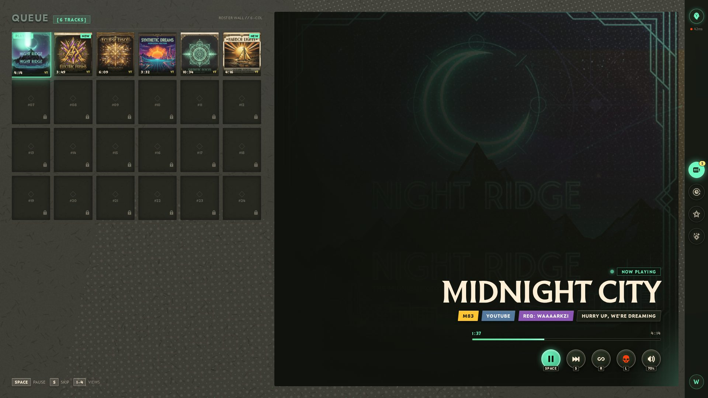
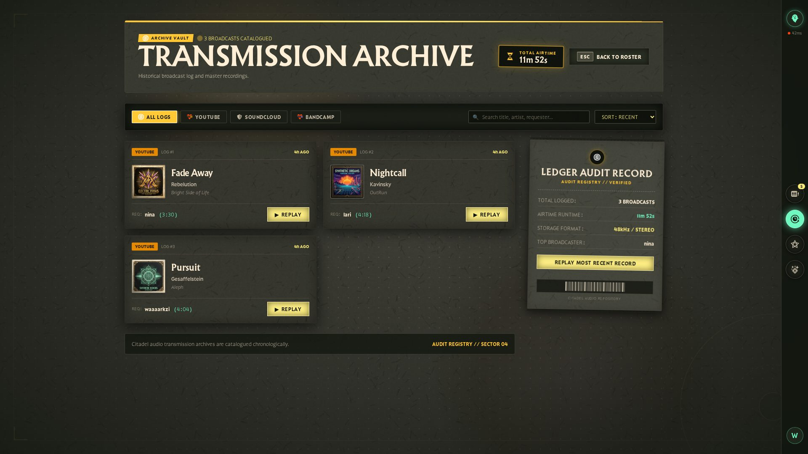
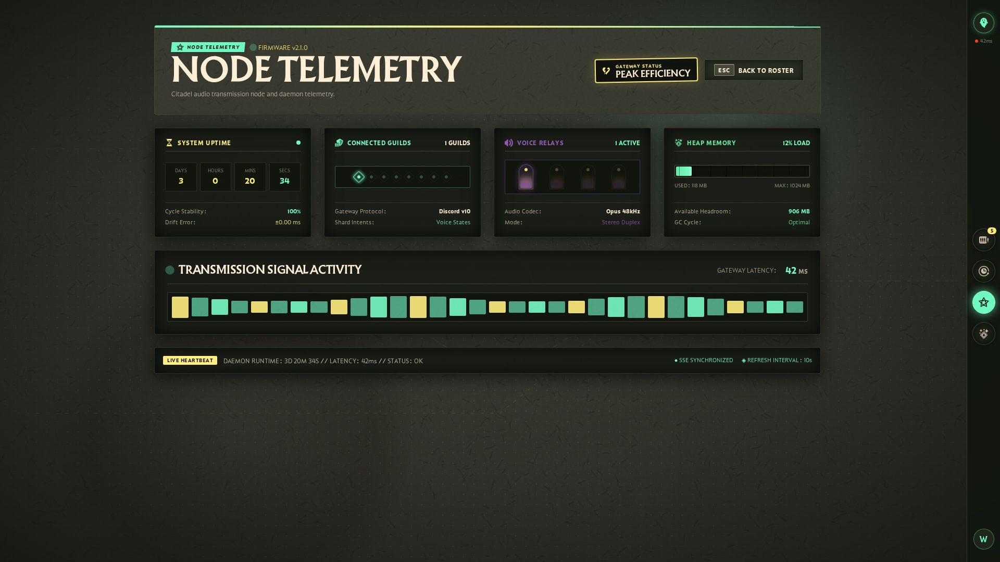
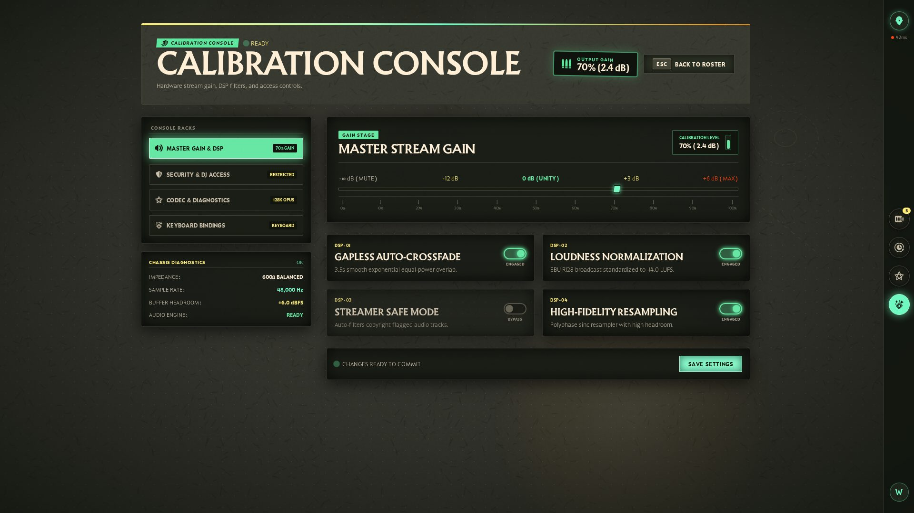

# 🎙️ Storaboga Sound

**A Discord music bot with a web dashboard built in the visual language of Valve's *Deadlock*.**

Streams high-fidelity audio from YouTube, SoundCloud, and Bandcamp into your voice channels — and lets your server control it from a dashboard that looks like the game's hero-select screen: warm parchment, soul-mint glow, art-deco noir. No Lavalink, no heavy containers — fits in 1GB of RAM.

> 🤖 **Built with an AI agent pipeline.** This project was designed and built by a multi-agent system — [Hermes Agent](https://github.com/NousResearch/hermes-agent) as the orchestrating brain, Google Antigravity (gemini-3.7-flash-high) as the building worker, and a research agent for verification. Every screen went through brief → build → visual self-review → human verdict. The failures, fixes, and full architecture are documented in **[AI-WORKFLOW.md](AI-WORKFLOW.md)** — including how over-constrained prompts nearly killed the design and what we did about it.

---

## 📸 Screenshots

| Now Playing — hero-select roster | Transmission Archive (History) |
|---|---|
|  |  |

| Node Telemetry (Status) | Calibration Console (Settings) |
|---|---|
|  |  |

---

## ✨ Features

- **🎧 High-fidelity audio** — streams via `yt-dlp → FFmpeg → Discord`, no external node, survives on 1GB RAM
- **🖥️ Web dashboard that mirrors the game** — queue as a hero-portrait roster wall, now-playing as a hero showcase, history as a transmission archive, settings as a calibration console, status as a telemetry command center
- **🔴 Real-time** — SSE push for now-playing, queue position, and playback state (no WebSockets)
- **🎨 Dynamic theming** — album art color extracted (`colorthief`) and applied as the track's accent across embeds + dashboard
- **🛡️ Role-based permissions** — User → Mod (DJ role) → Admin, checked server-side
- **📜 100% embed-based Discord responses** — no raw text, ever
- **📱 Responsive** — the whole dashboard works at 360px (mobile) through 1440px+
- **⌨️ Keyboard-navigable** — SPACE pause, S skip, 1–4 view switching

---

## 🏛️ The Design Story

The dashboard is an homage to the *Deadlock* hero-select screen — same construction, same materials:

- **Warm palette calibrated from Valve's own decompiled CSS** — cream `#FFEFD7` on warm charcoal `#10130D`, soul-mint `#70F8C1` active states, gold `#FFED79` identity
- **The game's real fonts** — Reaver (serif display), Retail Demo (sans body), Retail Text Demo (mono data)
- **Physical materiality** — paper grain, halftone dot patterns, mask-chamfered corners, two-layer hard text shadows, radial "soul shine" glows
- **Real game icons** — 100+ original SVGs served from the deadlock-api assets bucket
- **The real deadlock-ui web components** — `dl-shop-panel`, `dl-item-card`, `dl-hero-card` from `@deadlock-api/ui-react` render the game surfaces with their genuine JS behavior (hover-scale, tooltips, tiered grids)

Each screen is its own coherent fiction inside the same world:
- **Dashboard** — the hero-select room: queue as portrait roster, now-playing as showcase
- **History** — the *Transmission Archive*: every track catalogued as a broadcast record, replayable
- **Status** — *Node Telemetry*: the bot's vitals as hideout sigils
- **Settings** — *Calibration Console*: the transmitter's physical guts — gain racks, DSP switches, read-only diagnostics

---

## 🧰 Tech Stack

### Backend (Python 3.13, single process)
| Component | Tech | Why |
|---|---|---|
| Discord API | `discord.py` | Native slash commands, embeds |
| Audio engine | `yt-dlp` | YouTube / SoundCloud / Bandcamp / direct URLs |
| Audio playback | `FFmpeg` | PCM piping — no Lavalink, fits 1GB RAM |
| Web server | `FastAPI` + `uvicorn` | Serves static build + REST + SSE in-process |
| Realtime | `sse-starlette` | Server-push events, zero WebSocket overhead |
| Database | `aiosqlite` | Async SQLite, no server process |
| Color extraction | `colorthief` | Album-art → dynamic accent for embeds + UI |

### Frontend (React 19 + TypeScript + Vite 6)
| Component | Tech |
|---|---|
| UI framework | React 19 + TypeScript |
| Styling | Tailwind CSS v4 |
| Build | Vite 6 |
| Game components | `@deadlock-api/ui-core` + `@deadlock-api/ui-react` v1.5 |
| Realtime | `EventSource` (SSE) |

---

## 🚀 Getting Started

> **Note:** you need a Discord application + bot token, and `ffmpeg` on PATH. No external database or voice server required.

```bash
# 1. Clone
git clone https://github.com/Ansbach-0/StorabogaSound.git
cd StorabogaSound

# 2. Backend
python3 -m venv .venv
.venv/bin/pip install -r requirements.txt
cp .env.example .env        # fill DISCORD_TOKEN, DISCORD_CLIENT_ID/SECRET

# 3. Frontend
cd frontend
npm install
npm run build               # outputs to frontend/dist (served by FastAPI)

# 4. Run
cd ..
.venv/bin/python -m bot      # starts Discord bot + web server on :2497
```

Open `http://localhost:2497`, click **Login with Discord**, and the dashboard appears.

---

## 📁 Project Layout

```
storaboga-sound/
├── bot/                  # Discord bot: commands, audio player, permissions, DB
│   ├── audio/            # yt-dlp → FFmpeg pipeline, color extraction
│   └── db/               # aiosqlite queries
├── web/                  # FastAPI: auth, REST API, SSE, static serving
│   └── routes/           # api.py (REST), sse.py (events)
├── frontend/             # React 19 + Tailwind v4 + deadlock-ui components
│   ├── src/components/   # dashboard, archive, telemetry, calibration views
│   └── public/assets/    # game fonts, textures, masks, 100+ game icons
└── SPEC.md               # full specification & API contract
```

---

## ⚖️ Credits & Compliance

This project is a **fan project**. It is not affiliated with, endorsed by, or sponsored by Valve Corporation. *Deadlock* and all related characters, logos, and visual assets are trademarks and/or copyrighted materials of Valve Corporation.

### Third-party services & data sources
| Resource | What we use | License / Terms |
|---|---|---|
| [**deadlock-api**](https://deadlock-api.com) & [deadlock-ui](https://github.com/deadlock-api/deadlock-ui) | Game icons (100+ SVGs), fonts, textures, and the `dl-*` web components | Open-source, see [deadlock-api/deadlock-ui](https://github.com/deadlock-api/deadlock-ui) — an independent community API, not affiliated with Valve |
| [**Deadlock** (Valve)](https://deadlock.com) | Visual language inspiration: palette, materials, typography | Fan use; all rights to Valve |
| **UI reference frames** | Screenshots from 2026 community videos (post-*Old Gods*) used only as design references during development | Content belongs to the respective creators; not distributed in the repo |

### Open-source libraries
The project stands on the shoulders of excellent free software: **discord.py** (MIT), **FastAPI** (MIT), **yt-dlp** (Unlicense/Public domain), **FFmpeg** (LGPL/GPL), **React** (MIT), **Tailwind CSS** (MIT), **Vite** (MIT), **sse-starlette** (BSD), **colorthief** (MIT), **aiosqlite** (MIT), **Pillow** (MIT-CMU). Full license texts ship inside each package.

### A note on game assets
The game fonts, textures, and icons are **Valve's property**, used here under fan-project conventions. If you fork this project, keep the attribution above and do not redistribute the game assets for commercial purposes.

---

## 📜 License

Project code (backend, dashboard logic, custom UI) is provided under the [MIT License](LICENSE) unless otherwise noted. Game-derived assets remain the property of their respective owners and are **not** covered by the MIT grant.

---

*Made with 🎧, ☕, and an unreasonable amount of attention to a game's UI construction rules.*
